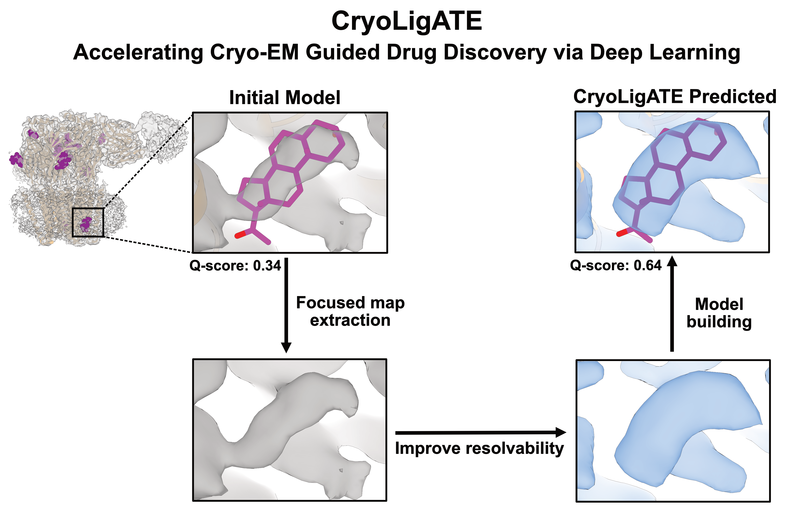

<picture>
  <source media="(prefers-color-scheme: dark)" srcset="docs/Intro_for_webpage_dark.png">
  <source media="(prefers-color-scheme: light)" srcset="docs/Intro_for_webpage_light.png">
  
</picture>


# Introduction
The full potential of cryo-EM in drug discovery remains limited by poor density resolvability
at ligand-binding interfaces. Although recent advances in deep learning have transformed cryo-
EM map enhancement, existing approaches largely focus on protein regions and often neglect
ligand-containing sites. Here, we present CryoLigATE, an AI framework specifically designed
to enhance the density resolvability of protein–ligand interfaces. We trained and evaluated CryoLigATE across a structurally diverse dataset including pharmaceutical drugs, lipids, steroids, and carbohydrates.

CryoLigATE features a streamlined, single-command interface. It automatically isolates the target sub-volume using a preliminary atomic model as a spatial reference, requiring no manual box curation. The pipeline is computationally efficient, with localized refinement completed in seconds on standard desktop-grade GPU hardware.

# Installation 

> **Note:** We strongly recommend installing CryoLigATE in a fresh Python or Conda environment to avoid dependency conflicts.

## Option A: Install CryoLigATE via PyPI (Recommended):

### 1. Create a clean environment with Python
```bash
conda create -n cryoligate python=3.10 -y
conda activate cryoligate
```
### 2. Install the package

```bash
pip install cryoligate -U
```

## Option B: Install directly from GitHub for the latest development updates:

### 1. Clone the repository and step into it

```Bash
git clone https://github.com/nandanhaloi123/CryoLigATE.git
cd CryoLigATE
```

### 2. Create the environment using the local file
```Bash
conda env create -f environment.yml
conda activate cryoligate
````

### 3. Link your local directory in editable mode
```Bash
pip install -e .
```

If you are installing on CPU-only or non-CUDA GPU hardware, the pipeline will automatically fall back to CPU processing. Note that the CPU version is significantly slower than the GPU version for 3D volumetric refinement.


# Inference

Before running inference or fine-tuning, download the pre-trained weights:

```bash
mkdir weights
wget -O weights/cryoligate_v2.0.0.pth https://github.com/nandanhaloi123/CryoLigATE/releases/download/v2.0.0/cryoligate_v2.0.0.pth
```

Download the example data used in the inference command:
```bash
mkdir -p example/8si9
wget -O 8si9.zip https://github.com/nandanhaloi123/CryoLigATE/releases/download/v2.0.0/8si9.zip
unzip 8si9.zip -d example/8si9/
rm 8si9.zip
```

Run inference using CryoLigATE (load conda enviornment with ```conda activate cryoligate```if you have not already):
> **Note:** Although the user provides an aligned PDB model containing the ligand, this coordinate information is utilized solely to localize the region of interest. Only the localized experimental density and the derived protein occupancy mask are used as input for CryoLigATE.


```bash
cryoligate-infer --weights weights/cryoligate_v2.0.0.pth --map example/8si9/emd_40503.map --pdb example/8si9/8si9.cif --resname Y4B --resid 402
```

# Contact

For any questions, discussions, or collaboration inquiries, please reach out:

* **Nandan Haloi**: [nandanhaloi123@gmail.com](mailto:nandanhaloi123@gmail.com), [nandan.haloi@scilifelab.se](mailto:nandan.haloi@scilifelab.se)
* **Lab Website**: [Nandan's Personal Webpage](https://nandanhaloi.netlify.app/)

**Bug Reports & Feature Requests:** If you encounter any issues while using CryoLigATE or have ideas for new features, please open an issue on our [GitHub Issues page](https://github.com/nandanhaloi123/CryoLigATE/issues) rather than sending an email. This helps us track problems efficiently and allows the entire community to benefit from the solutions!

# License
Our model and code are released under MIT License, and can be freely used for both academic and commercial purposes.


# Cite
If you use this code, dataset or the models in your research, please cite the following papers:
```bibtex
@article{haloi2026cryoligate,
  title={CryoLigATE: enhancing the resolvability of cryo-EM maps in protein-ligand complexes using deep learning},
  author={Nandan Haloi1, Rebecca J. Howard, and Erik Lindahl},
  journal={In Prep},
  year={2026},
}

